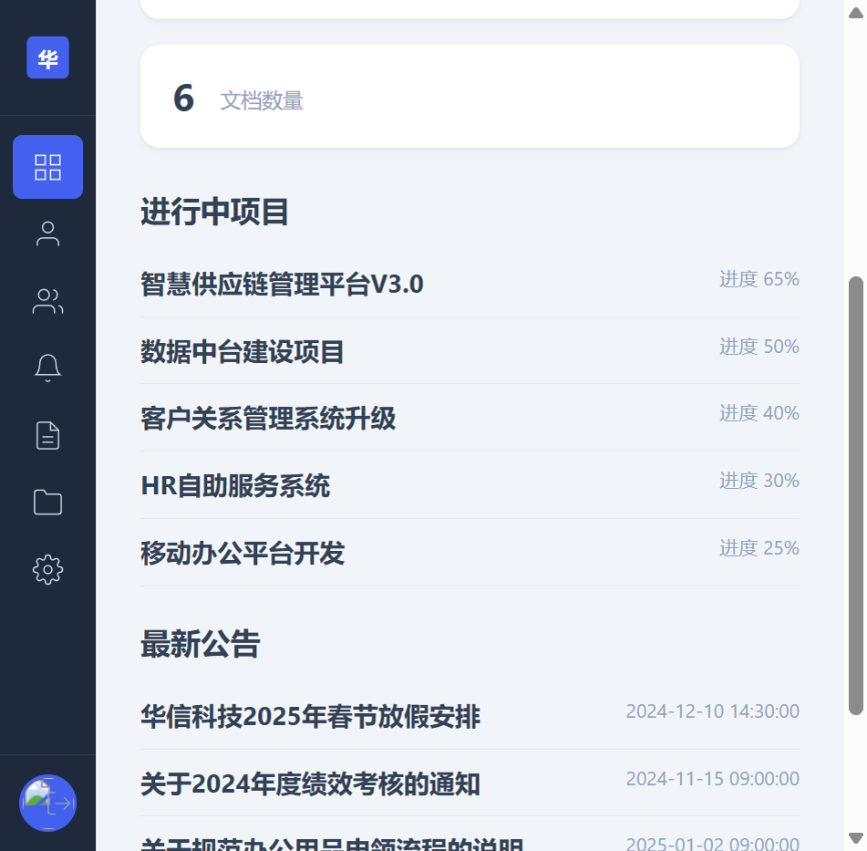
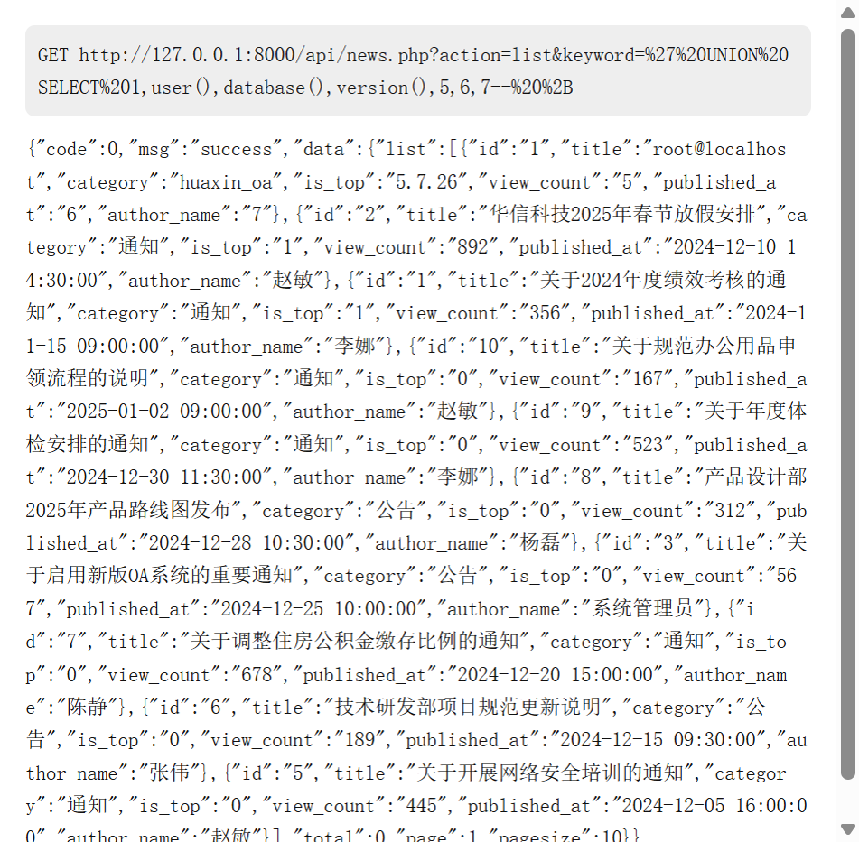
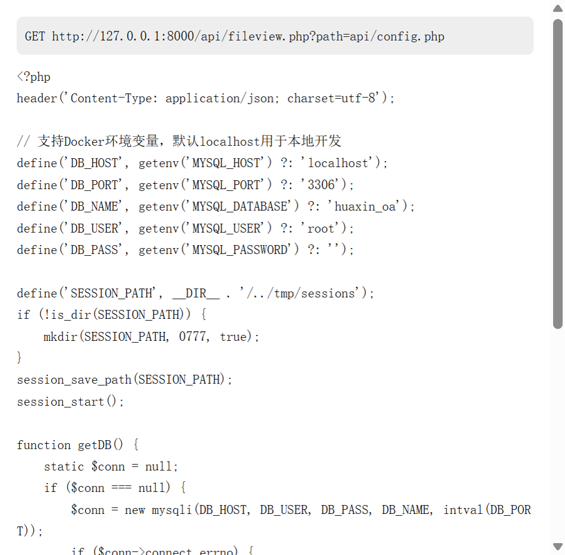
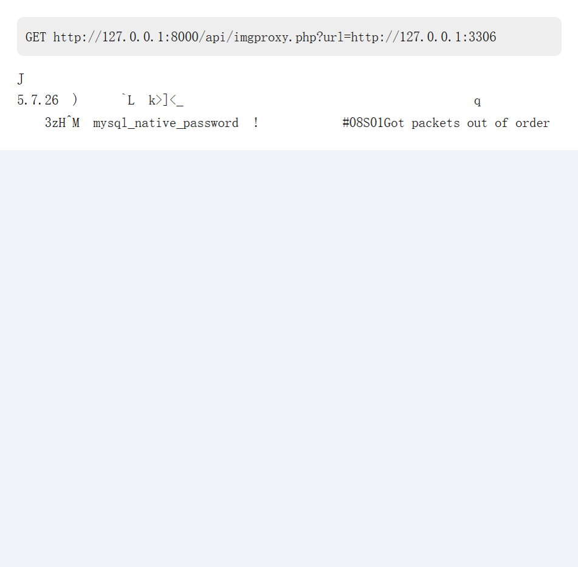
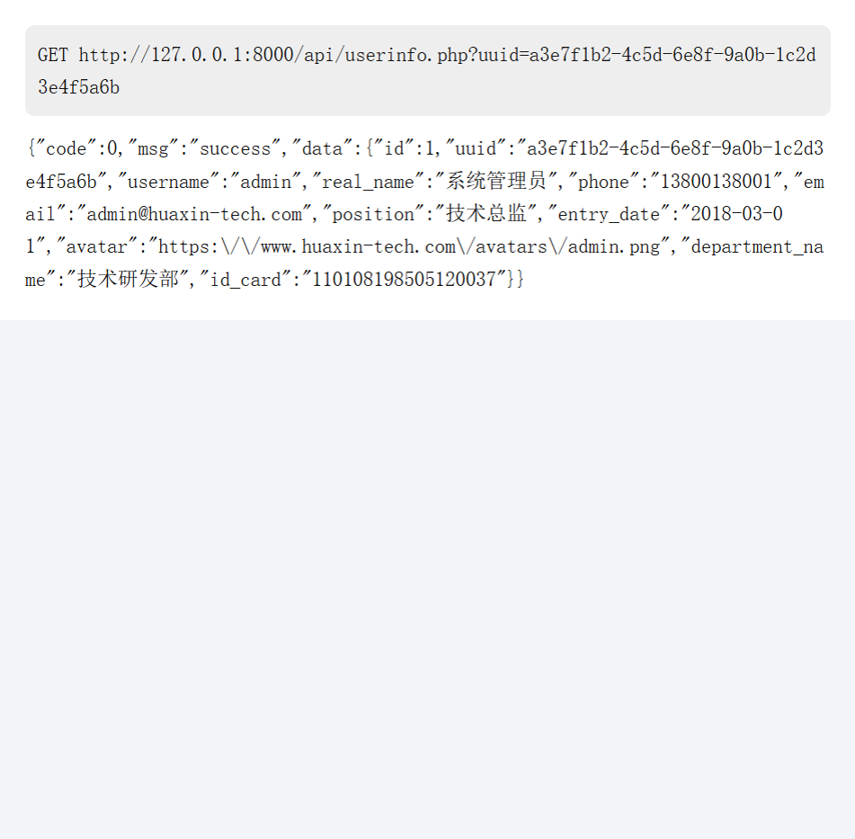
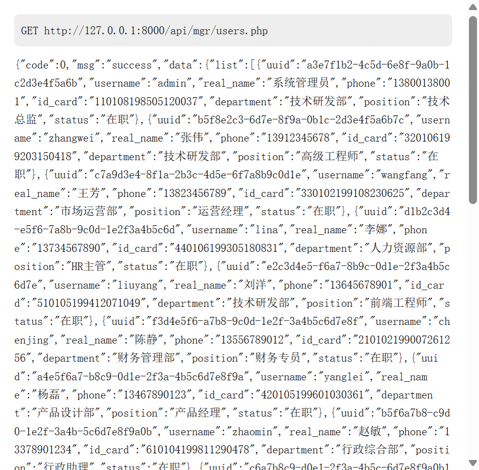
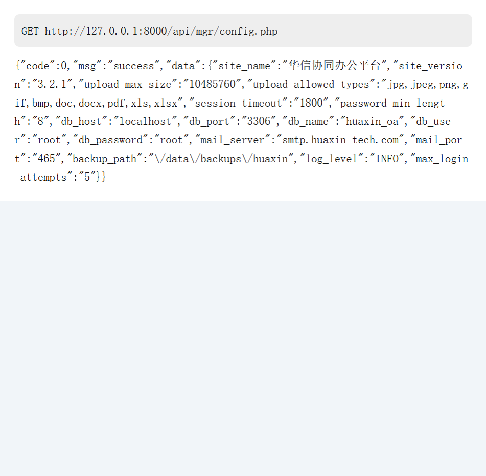

> **免责声明**：本文仅供学习交流参考，仅作网络安全技术研究使用，所涉目标为本人搭建的授权测试环境。凡因传播、借用本文任何信息与内容所产生的一切直接或间接后果及损失，均由当事人自行承担。若存在内容侵权情况，欢迎联系告知，将第一时间核查并下架处理。

这次的目标是一套协同办公平台（PHP + MySQL，前后端分离）。手上只有一个普通员工的账号，接下来就从这个低权限账号出发，看看能走多远。

## 0x01 信息收集

打开系统，一个很标准的企业 OA 登录页。



用普通员工账号登录进工作台。翻了一圈功能：公告、通讯录、项目管理、个人中心，前端交互基本都是调 `/api/*` 接口，这种前后端分离的架构，接口就是主战场。

## 0x02 SQL 注入（公告搜索）

公告列表接口 `/api/news.php` 有个 `keyword` 参数做标题搜索。先丢一个单引号探一下，接口直接把 SQL 错误吐了回来——LIKE 拼接，注入实锤。

列表查询是 7 列，直接 UNION 联合查询把 `user()`、`database()`、`version()` 一次性带出来：

```
GET /api/news.php?action=list&keyword=' UNION SELECT 1,user(),database(),version(),5,6,7-- +
```



第一行返回 `root@localhost`、`huaxin_oa`、`5.7.26`——root 权限的 MySQL，数据库版本 5.7。到这里整套数据库随便读，配合 `secure_file_priv` 为空还能进一步写文件，危害直接拉满。

## 0x03 任意文件读取（文档预览）

文档预览接口 `/api/fileview.php?path=` 本来是读上传目录里的文档的，但 `path` 没有任何限制，直接相对路径穿越：

```
GET /api/fileview.php?path=api/config.php
```



数据库配置源码直接回显，主机、账号、库名一览无余。Windows 下还可以读 `C:/Windows/win.ini` 之类的系统文件，相当于一个全盘文件读取器。

## 0x04 SSRF（图片代理）

用户头像走了一个代理接口 `/api/imgproxy.php?url=`，服务端 curl 转发，未限制内网地址。经典的内网探测姿势，直接打本机 3306：

```
GET /api/imgproxy.php?url=http://127.0.0.1:3306
```



MySQL 握手包原样回显：`5.7.26`、`mysql_native_password`。全回显 SSRF，内网端口探测、打内网服务都不在话下。

## 0x05 水平越权（个人信息）

个人中心接口 `/api/userinfo.php` 通过 `uuid` 参数查询用户信息，服务端没有校验 uuid 归属。把 uuid 换成管理员的：

```
GET /api/userinfo.php?uuid=a3e7f1b2-4c5d-6e8f-9a0b-1c2d3e4f5a6b
```



直接返回了管理员的手机号、身份证号等敏感信息。批量遍历一遍 uuid，全公司人员的身份信息就都到手了。

## 0x06 Cookie 提权

更绝的在后面：这套系统判断管理员身份靠的是 Cookie 里的 `hx_role` 字段。把普通用户的 `hx_role=0` 改成 `1`，直接访问用户管理接口 `/api/mgr/users.php`：



全员列表（含每个人的身份证号）直接吐出来。权限判断放在了客户端可控的 Cookie 上，等于没有权限。

## 0x07 未鉴权系统配置

顺着管理员功能再摸一遍，`/api/mgr/config.php` 这个系统配置接口连角色校验都没有，普通用户直接读：



`db_password`、邮件服务器、备份路径……系统敏感配置全量泄露。到这里，数据库账号密码都齐了。

## 0x08 文件上传双写绕过 GetShell

最后压轴：头像上传接口 `/api/upload.php` 用扩展名黑名单过滤，但文件名清理是单次替换。构造双写文件名：

```
shell.pphphp
  → 黑名单检查：pphphp 不在黑名单 → 通过
  → 过滤函数移除一个 "php" → shell.php
```

上传成功，返回的正是 `.php` 文件路径：


访问上传的文件，`SHELL_OK` 输出系统信息——GetShell 成功，服务器命令执行到手。

## 总结

一条完整的攻击链：**普通账号 → SQL 注入拖库 → 文件读取拿配置 → SSRF 探内网 → 水平越权薅全员身份 → Cookie 提权成管理员 → 未鉴权配置拿数据库密码 → 上传双写 GetShell**。

几个值得记的点：

- **权限判断绝不能放在客户端**：`hx_role` 放 Cookie 里当权限用，是最典型也最致命的设计错误
- **接口缺横向校验是重灾区**：uuid 换个值就是别人的隐私，服务端必须校验资源归属
- **单次替换过滤必被双写绕过**：黑名单 + `str_replace` 的组合，双写一击即穿
- **报错信息是注入点的放大器**：SQL 错误直接回显，省去了大量盲注成本
- 修复上：参数化查询、白名单校验路径、服务端角色校验、随机化上传文件名并禁执行，一个都不能少
