> 2025 福建省闽盾杯的 6 道题复盘。每题都附**题目附件**与**关键截图**，跟着做可以完整复现，Flag 汇总见文末。

## 0x01 签到题 2025

**考点**：国密算法 SM3

签到题给了一段 SM3 加密后的数据。SM3 是国密哈希标准，输出 256 位摘要。哈希不可逆，只能猜原文——试到 `heidun2025` 时，CyberChef 算出的 SM3 值与题目数据完全一致：

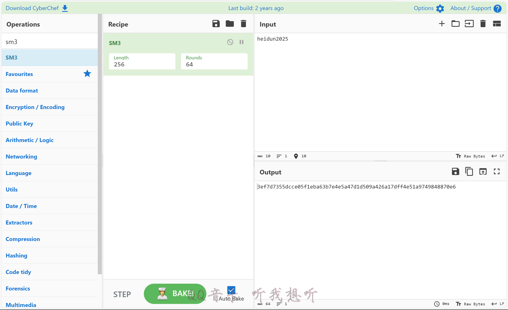

**Flag**

```text
flag{heidun2025}
```

## 0x02 Caesar

[下载附件 Caesar.zip](./files/Caesar.zip)

拿到密文：

```text
iodjxvlrkdyhj^abdeljefqz
```

直接跑凯撒分析没出 flag，说明不是简单统一移位。观察开头 `iodj`——每个字符 ASCII **减 3** 正好是 `flag`；而 `x` 加 3 是 `{`、`z` 加 3 是 `}`。

规律：**每 4 个字符一组，奇数组整体 ASCII 减 3，偶数组整体 ASCII 加 3**。

```python
groups = ["iodj", "xvlr", "kdyh", "j^ab", "delj", "efqz"]
result = ''
for i, s in enumerate(groups):
    shift = -3 if i % 2 == 0 else 3
    result += ''.join(chr(ord(c) + shift) for c in s)
print(result)
```

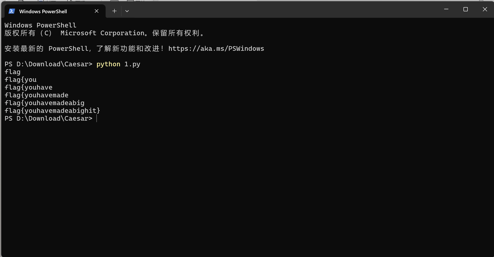

**Flag**

```text
flag{youhavemadeabighit}
```

## 0x03 QR_Maze

[下载附件 QR_Maze.zip](./files/QR_Maze.zip)

三层套娃：

1. zip 打不开 → **伪加密**，随波逐流一键修复（本质是把 ZIP 目录区的加密标志位清零）
2. 解出的文件用 **foremost 分离**出 xlsx 表格——一张 150×150 的 `0/1` 矩阵
3. 把表格当画布按格子值涂黑：大片噪声的正中央，浮出一张 **37×37（Version 7）** 的二维码，扫码即得

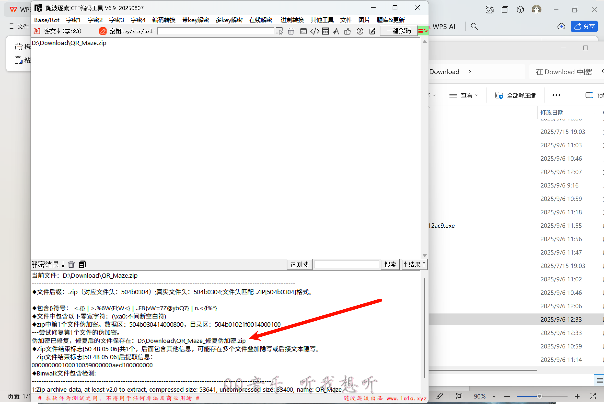

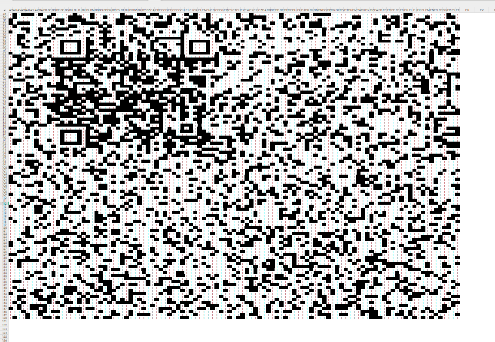

**Flag**

```text
flag{gk9g2LHrLWP0WQfTukeRZ5a4}
```

## 0x04 真假 Flag

[下载附件 真假Flag.rar](./files/真假Flag.rar)

层层过滤的「真假美猴王」：

1. 打开 rar，备注区藏着一段**莫斯电码**，解密后的小写结果 `rvzzskeohx6sa5sijqv1wysgrvsb5q5s` 是**里面 txt 的解压密码**
2. 用密码解出两个 flag，一真一假
3. 对真正的那个做 **Base64 解密**即得

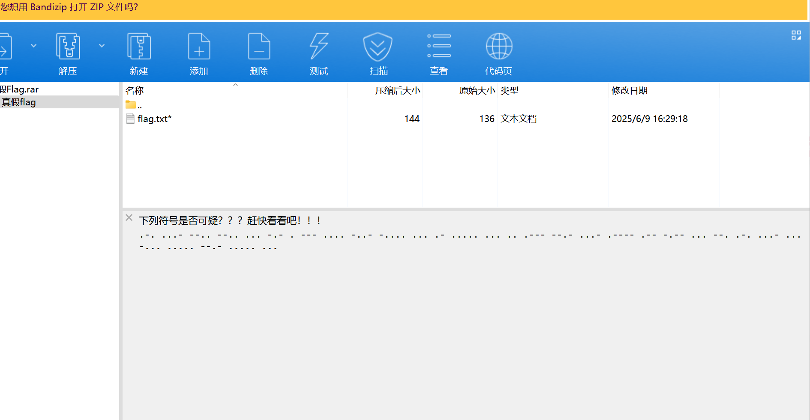

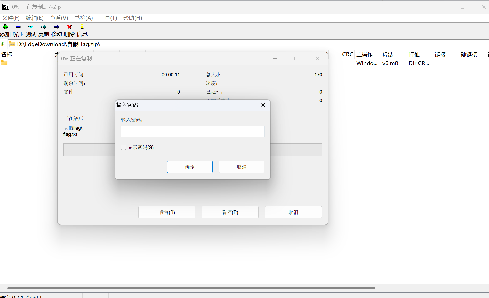

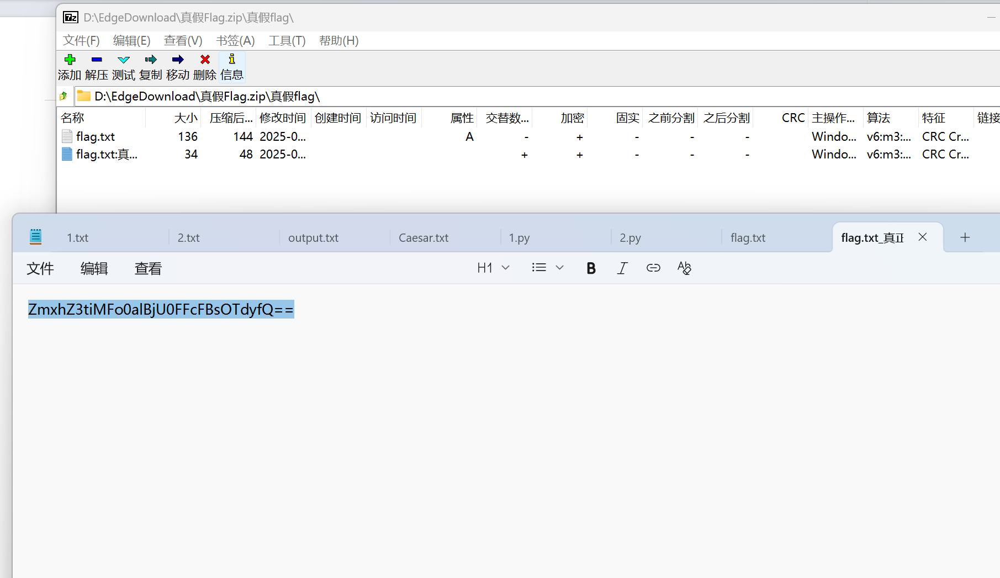

**Flag**

```text
flag{b0Z4jPcSAEpPl97r}
```

## 0x05 diordnA（Android）

[下载附件 diordnA.zip](./files/diordnA.zip)

文件名倒过来就是 Android。拖进 **jadx** 静态分析：

- `Part2LocationRequestCompat.QUALITY_LOW_POWER` 是 Android 系统常量，值 **102 = 'h'**；数组实际值 `[102, 101, 105, 100]` 逐个转 ASCII → `heid`
- Part3、Part4 的字符串直接写在代码里：`un_a`、`ndres_`
- 拼上 `2025`：

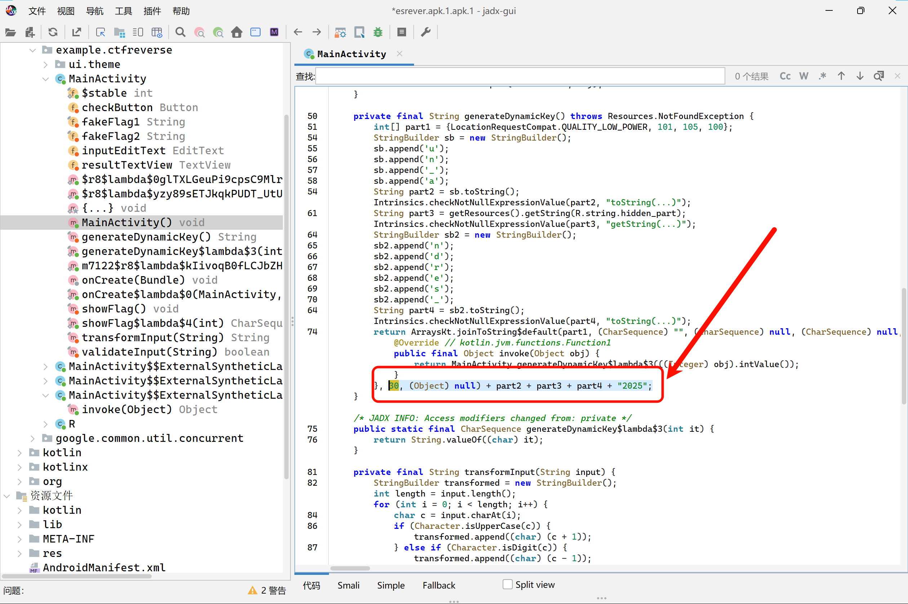

**Flag**

```text
flag{heidun_andres_2025}
```

## 0x06 开源组件的危害

[下载附件 开源组件的危害.zip](./files/开源组件的危害.zip)

题目描述里就写着「开源组件」——这是提示，也是题眼：

1. 手包的 `db` 文件夹里是 SQLite 文件，表结构 `on_links` / `on_categories` 直接暴露指纹：**OneNav**（开源网址导航组件）v0.9.30
2. 该版本存在已知风险，用 bkcrack 对手包 zip 做已知明文攻击（拿官方包里的 `.htaccess` 当明文），**恢复出密钥**：`cdceb027 e677c19d 05614135`
3. 用密钥解出一个新的 zip（密码 `123456`），进去读 `config.php`
4. 密码字段是 **ROT13**，解码即得

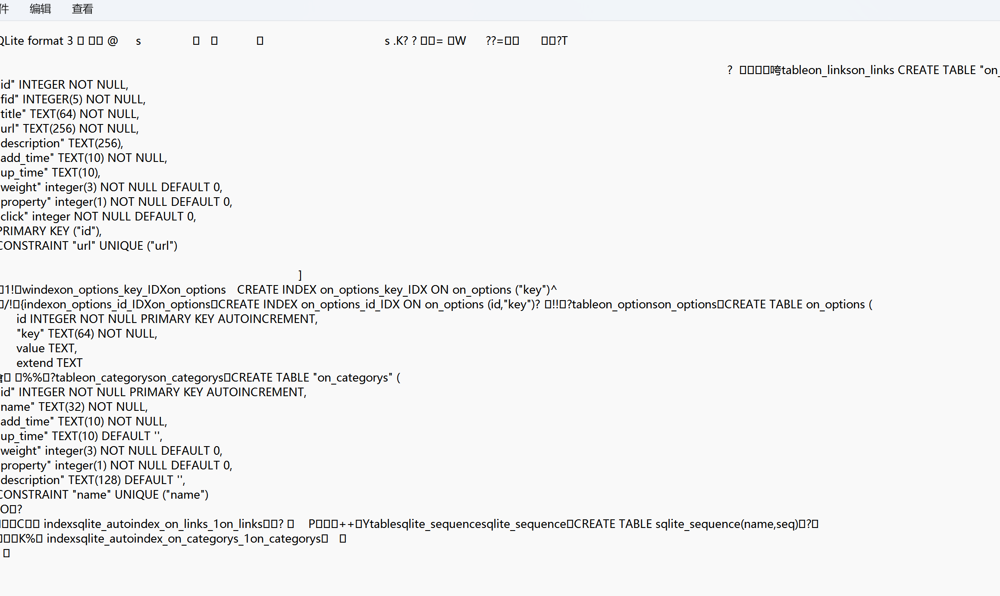

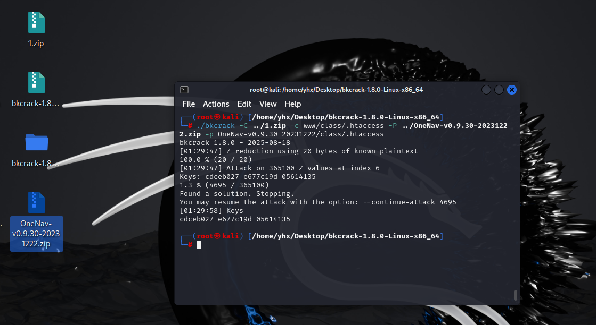

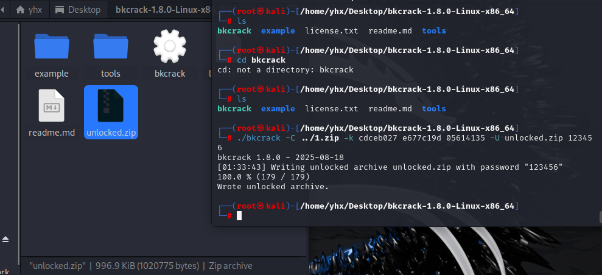

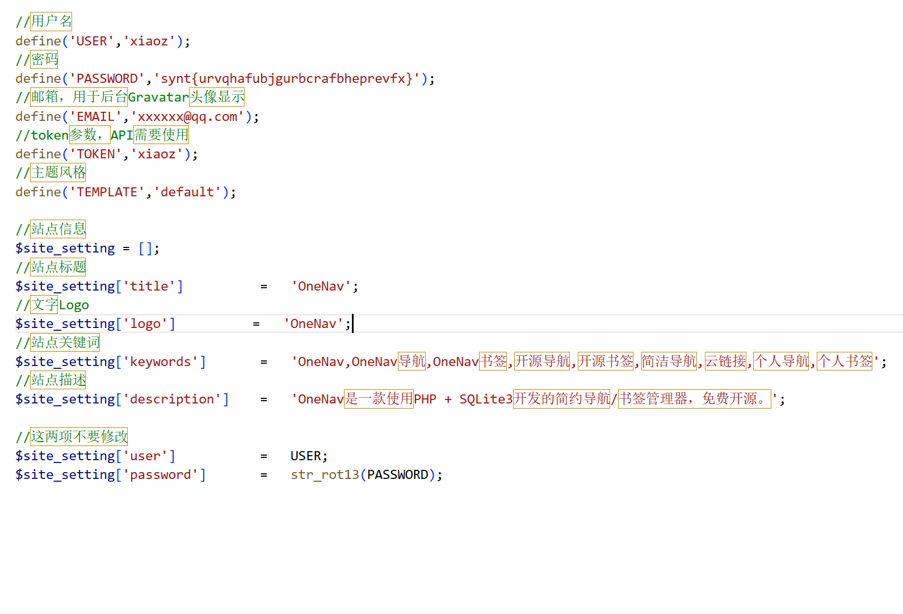

**Flag**

```text
flag{heidunshowtheopensourcerisk}
```

## Flag 汇总

| # | 题目 | 类别 | 核心考点 | Flag |
|---|------|------|---------|------|
| 1 | 签到题 2025 | Crypto | SM3 国密哈希 | `flag{heidun2025}` |
| 2 | Caesar | Crypto | 凯撒分组变体 | `flag{youhavemadeabighit}` |
| 3 | QR_Maze | Misc | 伪加密 + 表格藏码 | `flag{gk9g2LHrLWP0WQfTukeRZ5a4}` |
| 4 | 真假 Flag | Misc | 莫斯密码 + 压缩包套娃 | `flag{b0Z4jPcSAEpPl97r}` |
| 5 | diordnA | Reverse | 安卓逆向 + 常量隐写 | `flag{heidun_andres_2025}` |
| 6 | 开源组件的危害 | Web | 指纹识别 + N-day | `flag{heidunshowtheopensourcerisk}` |

比赛拿名次靠的是手速，涨技术靠的是赛后把每道题都啃一遍——附件都在文中，欢迎复现交流。
