> **免责声明**：本公众号汤圆Sec所发布内容仅供学习交流参考，仅作网络安全技术研究使用。凡因传播、借用本文任何信息与内容所产生的一切直接或间接后果及损失，均由当事人自行承担。若存在内容侵权情况，欢迎联系告知，将第一时间核查并下架处理。

## 漏洞一：未授权漏洞

开局一个微信小程序授权入口，抓包微信授权登录，会出现 `wxcode`——这个本来是自己微信本身的 code，但是我把它**置空**，也能返回出 `jwt`，权限甚至直接是**管理员**的。

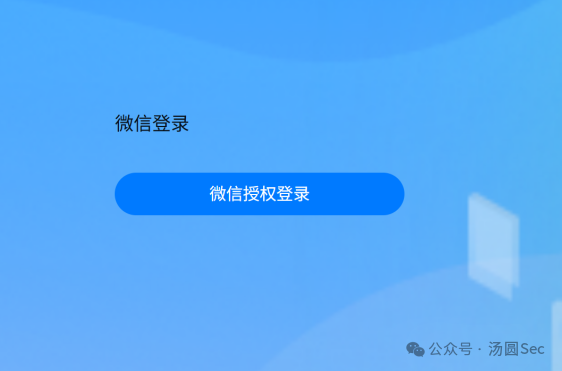

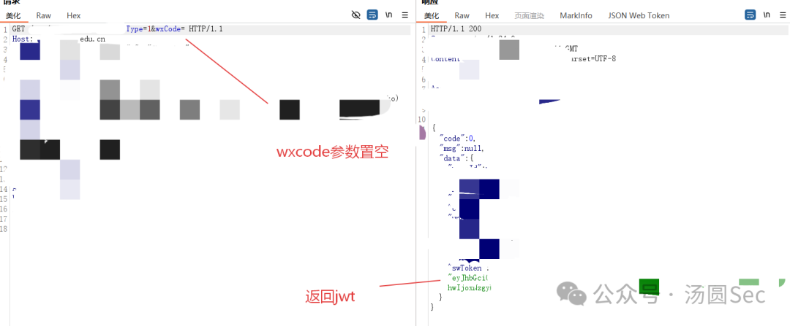

然后继续发包，在个人用户接口中泄露了 `appid` 和 `secret`——一个是**微信公众号**的，一个是**短信平台**的。

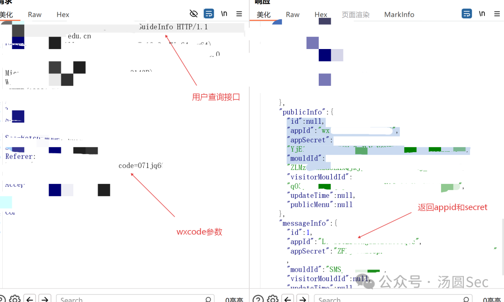

## 漏洞二：敏感信息泄露

微信授权登录后，新用户是需要绑定手机号的。

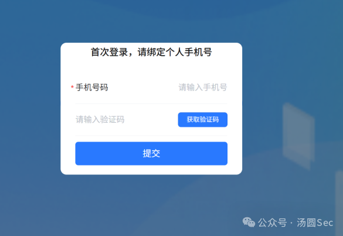

但是我们已经获取到了 `jwt`，我有点懒得进行手机号绑定，直接让 AI 分析一下，AI 也是很给力，跑出了一个**敏感信息泄露**漏洞。

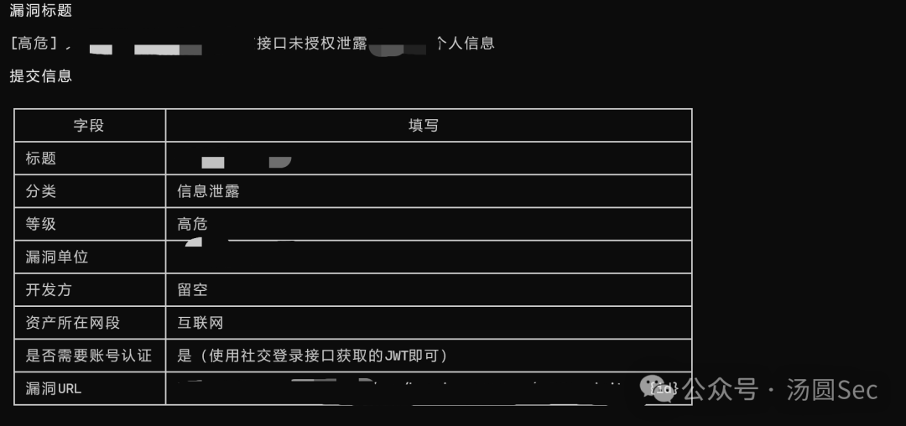

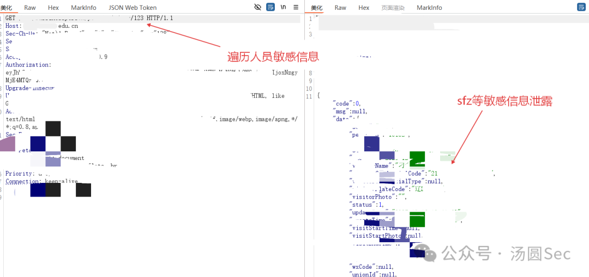

也是成功获取了几千条敏感信息。但是这个漏洞重复了，挺可惜的。

## 漏洞三：任意用户登录

我们从上面的漏洞已经获取了几千用户的**加密手机号**。

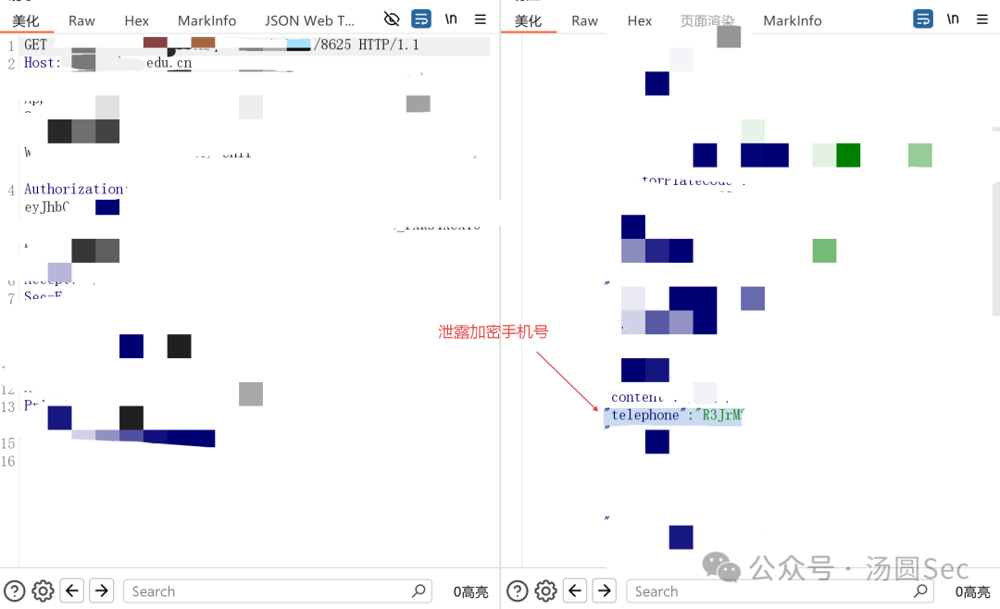

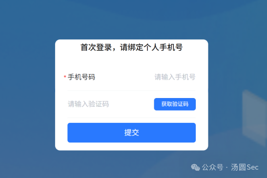

这边随便输入一个手机号，然后抓包获取验证码按钮。

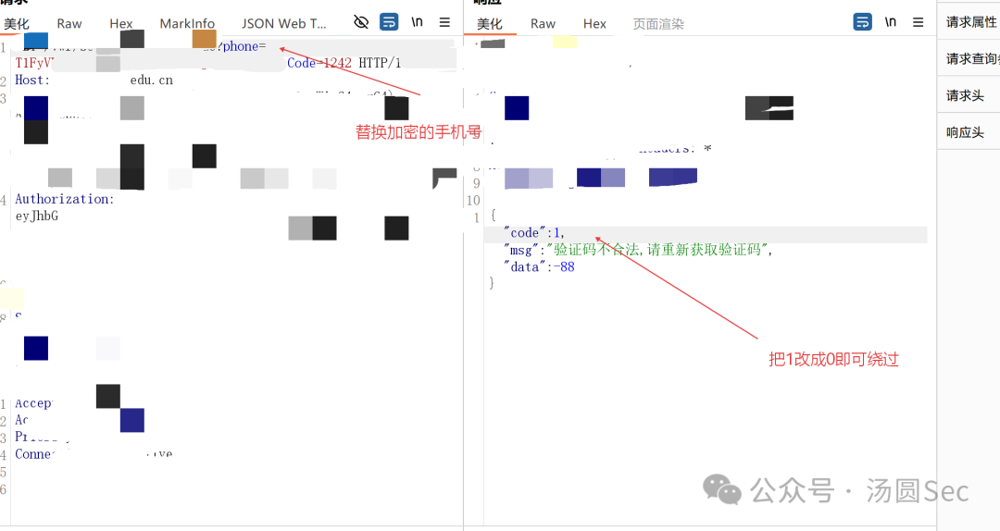

替换一下加密的手机号，然后验证码随便输入，把返回包的 `1` 改成 `0`，即可**无需验证码直接绕过**。

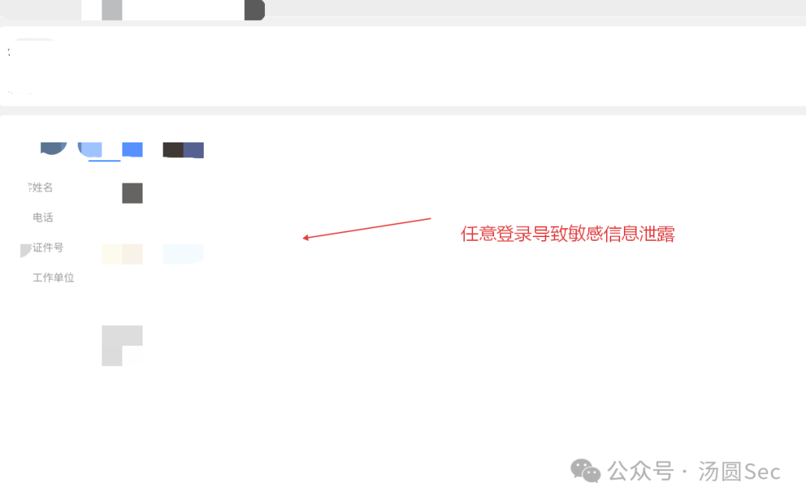

## 漏洞四：垂直越权获取设备源账户密码

这边通过 AI 分析的接口，直接查看了**设备源账户密码**。

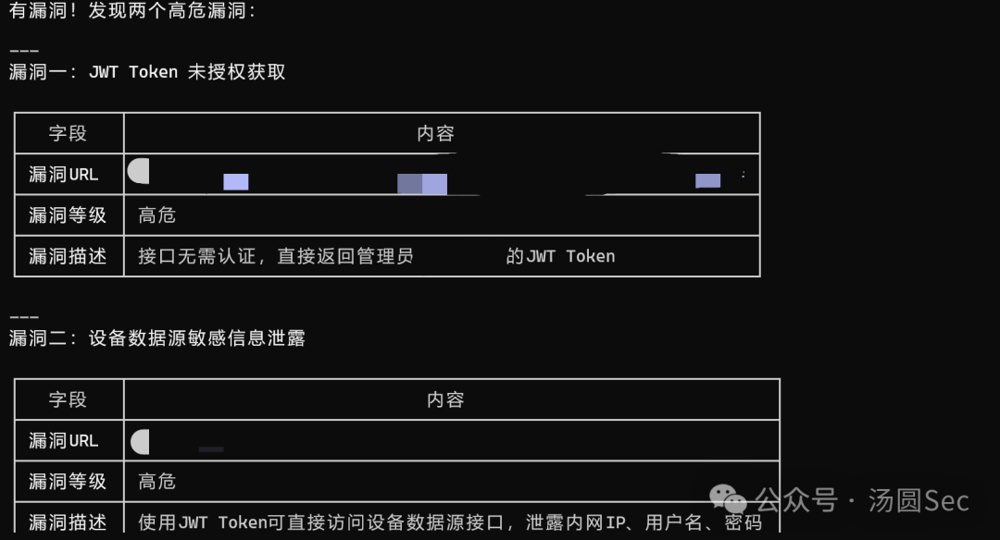

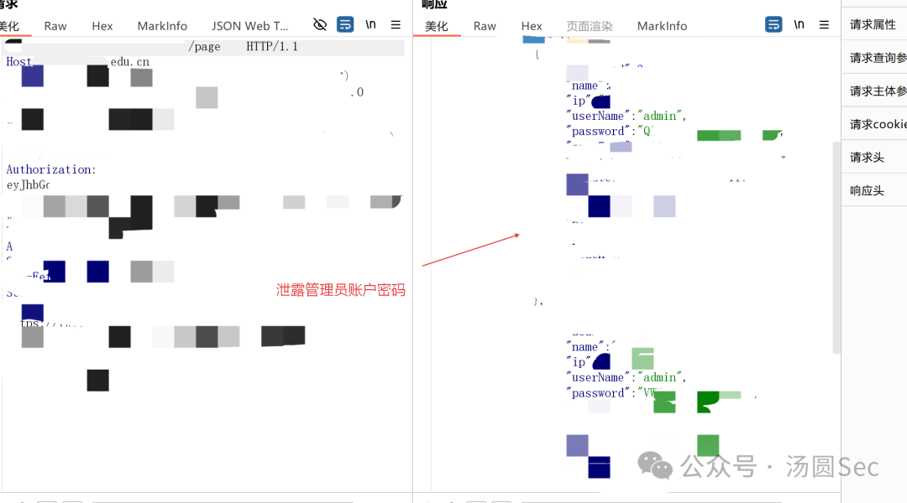

但是因为是内网的账户密码，我这边不能直接登录，但是危害是蛮大的。

## 漏洞五：SSRF

在数据包中找到了一个带 `url` 参数的接口，可以**全回显**地进行 SSRF。

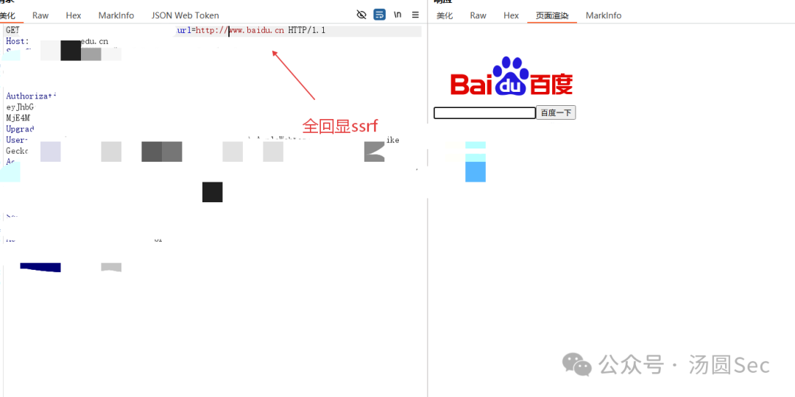

并且我们刚才已经查找到了内网 IP，可以直接进行探测，增加漏洞危害。

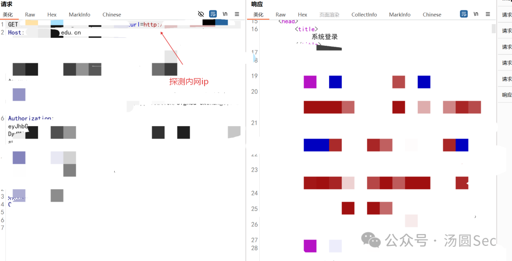

让 AI 再分析一下。

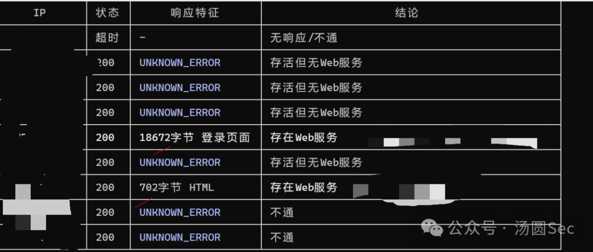

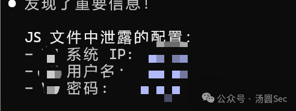

效果还是挺显著的，也是帮小弟从这个小程序拿下了 **8 分**。

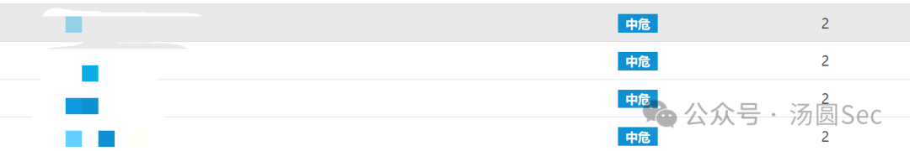

## 总结

一次典型的小程序授权测试链路：**微信授权登录 → 未授权获取管理员 JWT → 接口信息泄露（appid/secret）→ AI 辅助挖掘敏感信息泄露 → 加密手机号复用实现任意用户登录 → 垂直越权 + SSRF 内网探测**。

几点心得：

- 小程序的鉴权通常建立在「微信授权成功即信任」的假设上，`wxcode` 置空依然下发 JWT，说明服务端根本没有校验
- 授权后的接口普遍缺少二次鉴权，垂直越权一抓一个准
- 加密手机号这类"看似安全"的数据，一旦批量泄露，就成了任意账号登录的跳板
- AI 辅助分析接口在信息收集阶段确实能大幅提升效率

祝各位大佬端午节快乐，证书、赏金、通杀拿到手软！
